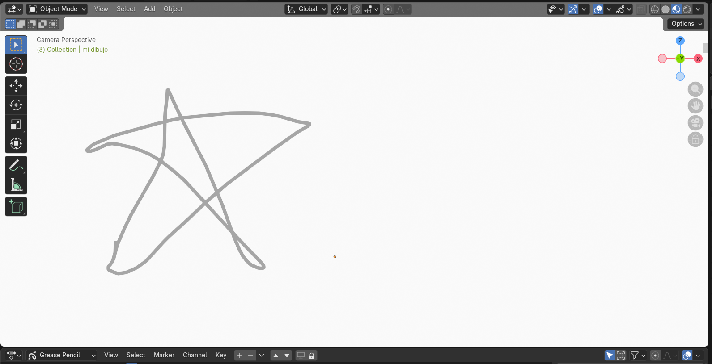
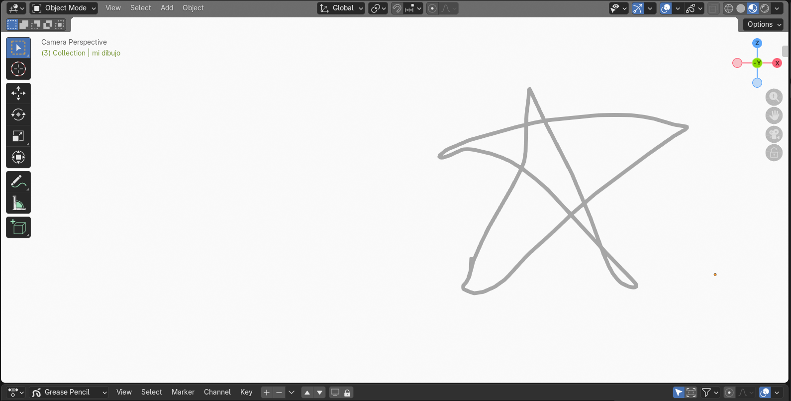

# 2.2. Representación matricial de las transformaciones bidimensionales

Para combinar múltiples transformaciones (como "rotar y luego trasladar", seguido de "escalar", referidas como **Transformaciones Compuestas**) de manera eficiente a los vértices de un objeto, se utiliza la representación matricial y **coordenadas homogéneas**.  

### ¿Por qué Coordenadas Homogéneas?
Si usaramos las operaciones convencionales, la traslación es una suma, mientras que el escalado y la rotación son multiplicaciones. Esto impide combinar sus efectos en una sola estructura unificada. Al introducir una tercera dimensión abstracta "$h=1$", podemos representar todas las transformaciones 2D como multiplicaciones repetidas de **matrices de $3 \times 3$**.

Un punto $(x, y)$ se convierte en un vector 3D de columna:
```math
P = \begin{bmatrix} x \\ y \\ 1 \end{bmatrix}
```

La forma unificada de la ecuación general es: **$P' = M \cdot P$**.
Y para una composición: **$M_{total} = M_n \cdot \cdots \cdot M_2 \cdot M_1$** (recuerda que gracias a la asociatividad, podemos multiplicar todas las matrices de los efectos y luego al final aplicarlas al punto, lo que ahorra muchísimos cálculos computacionales en Hardware Gráfico - GPU).

### Matrices Básicas (en coordenadas homogéneas)

* **Matriz de Traslación $T(t_x, t_y)$:**
  La traslación desplaza de forma aditiva integrando sus distancias en la última columna:

```math
\begin{bmatrix}
x' \\
y' \\
1
\end{bmatrix}
=
\begin{bmatrix}
1 & 0 & t_x \\
0 & 1 & t_y \\
0 & 0 & 1
\end{bmatrix}
\begin{bmatrix}
x \\
y \\
1
\end{bmatrix}
```

* **Matriz de Escalamiento $S(s_x, s_y)$:**
  Situado en la diagonal principal:

```math
\begin{bmatrix}
x' \\
y' \\
1
\end{bmatrix}
=
\begin{bmatrix}
s_x & 0 & 0 \\
0 & s_y & 0 \\
0 & 0 & 1
\end{bmatrix}
\begin{bmatrix}
x \\
y \\
1
\end{bmatrix}
```

* **Matriz de Rotación $R(\theta)$:**
  Realiza el giro respecto al vértice central u origen de nuestro plano. Para girar en un punto que no sea el cero, la transformación compuesta sería Trasladar al origen > Rotar > Trasladar a su posicion orginal ($T(x,y) \cdot R(\theta) \cdot T(-x,-y)$).

```math
\begin{bmatrix}
x' \\
y' \\
1
\end{bmatrix}
=
\begin{bmatrix}
\cos(\theta) & -\sin(\theta) & 0 \\
\sin(\theta) & \cos(\theta) & 0 \\
0 & 0 & 1
\end{bmatrix}
\begin{bmatrix}
x \\
y \\
1
\end{bmatrix}
```

---

## 2.2.1. Implementación Básica de Multiplicación con Homogéneas
El poder del cálculo recae en que todo se resume en multiplicar matrices de `3x3`. Mira este algoritmo puro usando NumPy de la estructura subyacente que corren los motores (como OpenGL o Vulkan) para calcular los polígonos de tu pantalla.

```python
import numpy as np

# Nuestro punto original (x=5, y=5)
# Agregamos el '1' para homogenizarlo
P = np.array([5, 5, 1])

# Queremos: Rotar 90 grados y después trasladar (+10 en X, 0 en Y)
angulo = np.radians(90)
M_rot = np.array([
    [np.cos(angulo), -np.sin(angulo), 0],
    [np.sin(angulo),  np.cos(angulo), 0],
    [0,             0,              1]
])

M_tras = np.array([
    [1, 0, 10],
    [0, 1,  0],
    [0, 0,  1]
])

# 1. Componemos la Transformación
# Orden matemático de derecha a izquierda: Tras * Rota * Punto
# M_total = M_traslacion * M_rotacion
M_total = np.dot(M_tras, M_rot)

# 2. Aplicamos la matriz total M_total de 3x3 al punto P
P_final = np.dot(M_total, P)

print(f"El punto final en el espacio 2D es: ({P_final[0]:.2f}, {P_final[1]:.2f})")
# Resultado -> (-5.00, 5.00) luego se translada la x a +10 -> Da: (5.00, 5.00)
```

---

### Ejercicio práctico: Control con teclas de dirección
Aplicación de la representación matricial para mover un objeto en Blender usando Python (traslación):

```python
import bpy

class ModalMoveOperator2D(bpy.types.Operator):
    """Movimiento 2D real: Flechas para X y Z"""
    bl_idname = "object.modal_move_operator_2d"
    bl_label = "Modal Move Operator 2D"

    def modal(self, context, event):
        obj = bpy.data.objects.get("mi dibujo")
        
        if obj is None:
            return {'FINISHED'}

        if event.value == 'PRESS':
            # --- MOVIMIENTO HORIZONTAL ---
            if event.type == 'LEFT_ARROW':
                obj.location.x -= 0.5
            elif event.type == 'RIGHT_ARROW':
                obj.location.x += 0.5
            
            # --- MOVIMIENTO VERTICAL (CORREGIDO) ---
            # Usamos 'z' para que suba/baje en la pantalla 
            # y no se acerque/aleje (que es lo que hace el eje 'y')
            elif event.type == 'UP_ARROW':
                obj.location.z += 0.5
            elif event.type == 'DOWN_ARROW':
                obj.location.z -= 0.5

            # Salida del modo
            elif event.type == 'ESC':
                print("Control 2D finalizado.")
                return {'FINISHED'}

        return {'RUNNING_MODAL'}

    def invoke(self, context, event):
        context.window_manager.modal_handler_add(self)
        print("Control 2D Activo: Flechas para mover, ESC para salir.")
        return {'RUNNING_MODAL'}

# Registro del operador
if hasattr(bpy.types, "ModalMoveOperator2D"):
    bpy.utils.unregister_class(ModalMoveOperator2D)
    
bpy.utils.register_class(ModalMoveOperator2D)
bpy.ops.object.modal_move_operator_2d('INVOKE_DEFAULT')
```

**Resultado de la transformación bidimensional (Traslación):**

*Ubicación 1 (Posición Inicial):*


*Ubicación 2 (Después de aplicar la traslación con las teclas direccionales):*
