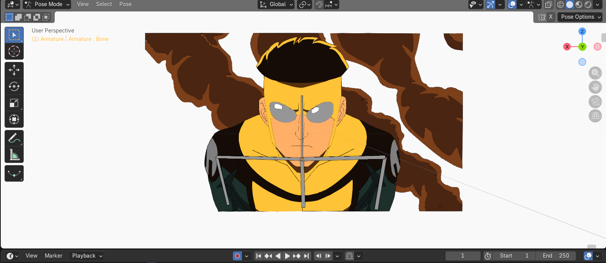

# 2.3. Trazo de líneas curvas

Los puntos y las líneas rectas en la graficación de sistemas son fundamentales, pero las formas y modelados de figuras reales rara vez son únicamente compuestas por polígonos rectos. Así, usamos curvas creadas mediante expresiones matemáticas polinomiales que aproximan o interpolan los vértices o "puntos de control". 

Estas expresiones matemáticas garantizan que se genere una línea fluida y sin vértices o puntas drásticas —una propiedad conocida como **Continuidad**, donde se busca al menos una curvatura suave de primera derivada (la tangente $C^1$) y de la segunda derivada ($C^2$). El balance y uniones de estos polinomios modelan las "Curvas Spline".

---

## 2.3.1. Bézier
Desarrollada inicialmente por Pierre Bézier en las fábricas de Renault. Las curvas de Bézier están definidas siempre por un set de **puntos de control** donde no interpolan, sino que "aproximan" a los puntos internos.

1. La curva siempre arranca en el primer punto de control $P_0$ y siempre termina en el último punto generador $P_n$.
2. La curva entera está delimitada por la envolvente convexa de sus puntos.
3. Tienen un grado de polinomio equivalente a la cantidad de vértices menos 1 (es decir, una de cuatro puntos será Cúbica o Grado 3). Si cambias un vértice intermedio, toda la geometría de la curva entera cambia.

* **Bézier Cuadrática** (Requiere 3 puntos $P_0, P_1, P_2$):
  $P(t) = (1-t)^2 P_0 + 2(1-t)t P_1 + t^2 P_2$, donde $t \in [0,1]$
  
* **Bézier Cúbica** (Las más comunes, requieren 4 puntos $P_0, P_1, P_2, P_3$):
  $P(t) = (1-t)^3 P_0 + 3(1-t)^2 t P_1 + 3(1-t) t^2 P_2 + t^3 P_3$

---

## 2.3.2. B-spline (Basis Splines)
Surgieron para solucionar el principal problema de las curvas de Bézier: en una Bézier, modificar un punto afecta toda la curva. 

Las B-splines están hechas uniendo polinomialmente partes locales. Ofrecen **control local**; mover un punto de control solo afectará una sub-región o segmento en el trazo, y el resto permanece rígido. 
A su vez:
- Suelen no interceptar ningún punto de control.
- Son las curvas más poderosas usadas en modelado 3D por su predictibilidad y fluidez.

---

### Ejercicio práctico: Dibujo de animación (Interpolación usando Curvas)
Las curvas se usan mucho para animar posiciones suaves (Easing o interpolación de "keyframes"), además de para dibujar. En el siguiente script podemos generar una Curva de Bézier Cúbica y trazar sus puntos resultantes.

```python
import numpy as np
import matplotlib.pyplot as plt

def bezier_cubica(p0, p1, p2, p3):
    """
    Interpolador de 4 vectores control. Calcula las posiciones en 100 pasos.
    """
    t = np.linspace(0, 1, 100) # array de 0 a 1 en 100 segmentos
    # Aplicando el polinomio: P(t) = (1-t)^3 P0 + 3(1-t)^2 t P1 + 3(1-t) t^2 P2 + t^3 P3
    c1 = (1 - t)**3
    c2 = 3 * ((1 - t)**2) * t
    c3 = 3 * (1 - t) * (t**2)
    c4 = t**3
    
    # Transponemos y multiplicamos para darles forma de coordenada x, y
    x = c1*p0[0] + c2*p1[0] + c3*p2[0] + c4*p3[0]
    y = c1*p0[1] + c2*p1[1] + c3*p2[1] + c4*p3[1]
    
    return x, y

if __name__ == "__main__":
    # Nodos o Puntos de Control: P0 (Inicio), P1, P2 (Curvaturas o Tensión), P3 (Fin)
    p0, p1, p2, p3 = (1, 1), (2, 8), (6, 9), (7, 2)

    # 1. Obtenemos los 100 puntos en los espacios t
    x_curva, y_curva = bezier_cubica(p0, p1, p2, p3)

    # 2. Dibujamos
    plt.figure(figsize=(6,4))
    
    # Dibujar la curva
    plt.plot(x_curva, y_curva, label='Curva de Bézier Cúbica', color='blue', linewidth=3)
    
    # Dibujar el esqueleto estructural y los puntos (la línea de tensión)
    puntos_x = [p[0] for p in [p0, p1, p2, p3]]
    puntos_y = [p[1] for p in [p0, p1, p2, p3]]
    
    plt.plot(puntos_x, puntos_y, 'ro--', label='Polígono de control (Convexa)')
    plt.scatter([p0[0], p3[0]], [p0[1], p3[1]], c='green', s=100, zorder=5, label='Nodos Extremos')
    
    plt.legend()
    plt.title("Ejemplo de Interpolación Polinomial en Py")
    plt.grid()
    plt.show()
```

**Resultado de la práctica (Dibujo en animación con uso de curvas y esqueletos virtuales en Blender):**

Las curvas no solo se utilizan para desplazar un objeto suavemente, sino que conforman el trazo del dibujo en software como Blender (con Grease Pencil), donde los contornos del personaje y su deformación usando un "Armature" (esqueleto de huesos) están construidos sobre matemáticas de curvas 2D. 

