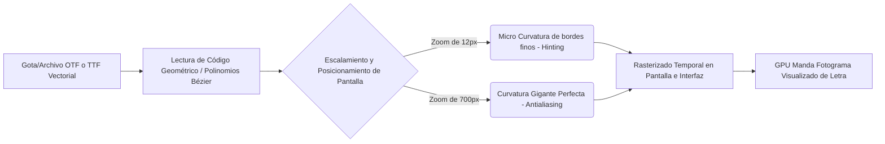

# 2.5. Uso y creación de fuentes de texto

Los objetos más extensos en visualización, interfaces e industria de cómputo en la historia han sido los fragmentos legibles de un sistema: **Las Tipografías / Tipos de letras**.
El texto en la graficación por computadora de una PC, celular o monitor es procesado bajo dos corrientes y formatos principales al guardar estos archivos.

### 1. Fuentes de Mapa de Bits (Bitmapped o Raster fonts)
Antes de la llegada de cálculos vectoriales en computadoras rápidas, el texto era procesado directamente píxel por píxel.
* Se definen como una retícula o matriz.
* Fueron la base para interfaces en MS-DOS, Apple 2 o consolas retro de 8/16 bits.
* Aún hoy se usan en micro-pantallas LED (como electrodomésticos o sistemas bancarios básicos).
* **Desventaja principal (El "Diente de Sierra"):** Las resoluciones estáticas al intentar aumentar un solo punto su *Talla o Escala*, el software expande los bloques (efecto "Pixel Art" muy bloqueado o feo cuando no es intención artística).

### 2. Fuentes Vectoriales y de Contornos (Outline o Stroke fonts)
La industria dominó la visualización gracias al estandar de Adobe/Microsoft en formatos **TrueType (ttf)** y más tarde en **OpenType (otf / woff)**.
* Se diseñan almacenando listas de líneas de contornos en vez de píxeles de interior.
* La anatomía geométrica de los glifos de la clase se calcula **usando curvas paramétricas y ecuaciones matemáticas Splines y de Bézier** abordadas en la unidad 2.3.
* Si le pides a Adobe PDF que renderice una simple 'S', realiza los cáculos iterativos en esa 'S' e inmediatamente después convierte "Temporalmente a Bits" (fase conocida como *Rasterización* de contorno y rellenado de par-impar / even-odd).  

**Diagrama de Arquitectura de Renderizado Textual:**



#### Fenómenos vitales en las "Fuentes Modernas" vectoriales:
- **Hinting Grafico (Ajuste a Retícula):** Ocurre porque la cuadrícula o matriz real del celular puede cortar una curva fina artificialmente en fracciones incompletas e imborrosas (los píxeles son de bloques cuadrados duros). El Hinting fuerza matemáticamente a esos vértices sub-píxeles vectoriales hacia bordes físicos enteros del LED.
- **Anti-aliasing (Suavizado de Bordes de Lectura):** Utiliza escalas de grises (por lo regular sub-píxeles de rojo verde o azul "ClearType" de Windows) que el ojo humano fusiona desde la distancia y parece una curva redondísima perfecta borrando el "pixelado escalonado" original en los trazos de curvatura.

---

### Ejercicio práctico: Rasterización y Carga de Fuente TrueType (.ttf)
En este ejemplo usaremos la librería gráfica general de Python `Pillow` (`PIL`), muy usada para graficación 2D en servidores y procesamiento web en Python, para leer los vectores `.ttf` y plasmarlos en un lienzo raster.

*Para ejecutar, instala la librería en consola:* `pip install Pillow`

```python
from PIL import Image, ImageDraw, ImageFont

def renderizar_texto_vectorial(texto, ruta_fuente, tamano, ruta_salida):
    # 1. Crear un 'Lienzo' base (Mapa de bits de 500x200 px), color blanco
    lienzo = Image.new('RGB', (500, 200), color='white')
    
    # 2. Inicializar el motor de dibujo 2D
    dibujante = ImageDraw.Draw(lienzo)
    
    try:
        # 3. Cargar la fuente vectorial.
        # Pillow internamente accede a la librería FreeType, lee los 'Béziers' 
        # del archivo y los escala a tamaño 'tamano' aplicando Anti-Aliasing.
        fuente = ImageFont.truetype(ruta_fuente, tamano)
    except IOError:
        print("Fuente Arial no encontrada en la ruta por defecto. Usa una ruta ttf válida.")
        # Fuente de mapa de bits (raster) por si falla
        fuente = ImageFont.load_default() 
        
    # 4. Rasterizar el texto en el lienzo: Coordenadas(X, Y), String, Color, Fuente 
    # El color es una tupla RGB (Cian Oscuro)
    dibujante.text((20, 50), texto, fill=(0, 100, 150), font=fuente)
    
    # 5. Guardar la imagen final ya rasterizada y pixelada para la pantalla
    lienzo.save(ruta_salida)
    print(f"Éxito. Texto renderizado y guardado en: {ruta_salida}")

if __name__ == "__main__":
    # Importante: Proporcionar una fuente de sistema. 
    # Si estas en Windows "arial.ttf" funcionará directamente.
    renderizar_texto_vectorial(
        texto="Graficación 2D!", 
        ruta_fuente="arial.ttf", 
        tamano=60, 
        ruta_salida="texto_renderizado.png"
    )
```